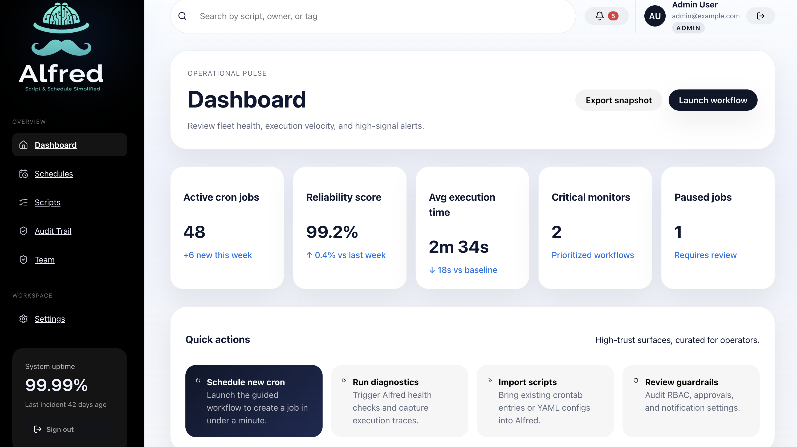
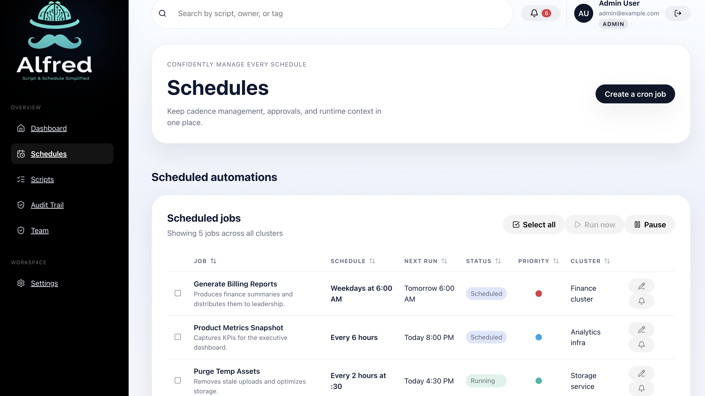
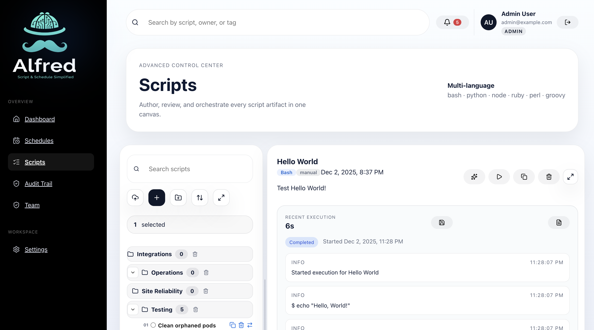
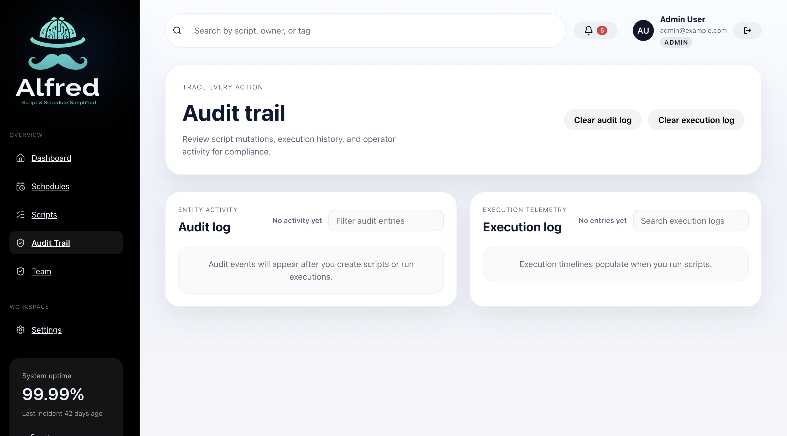
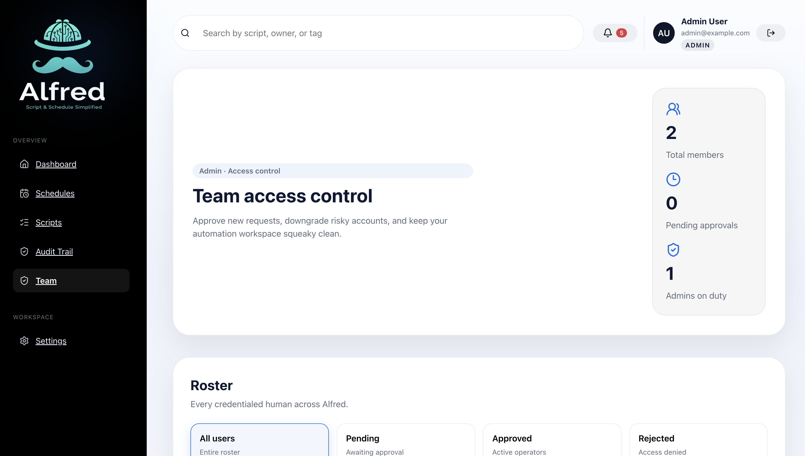
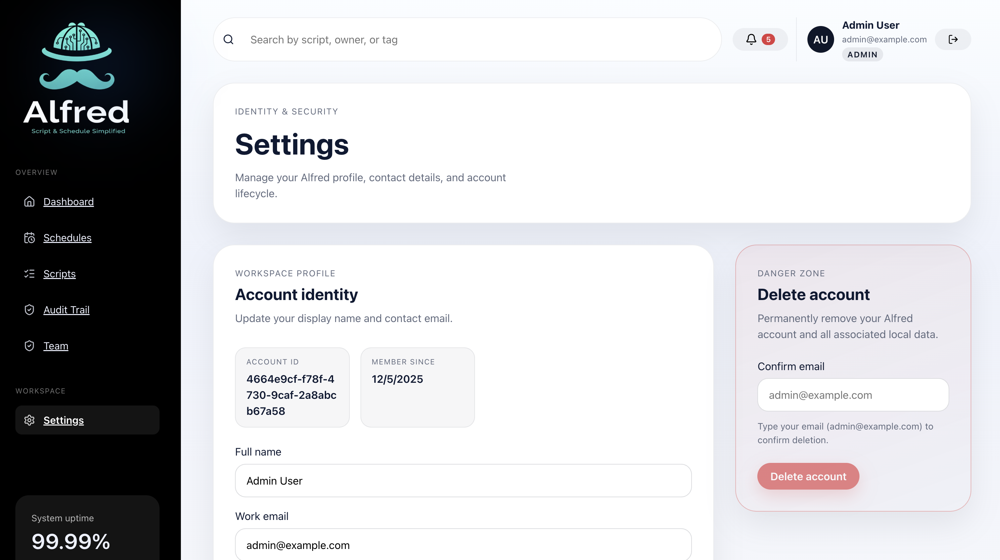

# Alfred

## Introduction
Alfred is a sleek control center for cron automation. It blends a folder-aware script library, inline editor, and AI review with one-click runs, live telemetry, and audit-ready history—keeping every job organized, explainable, and safe for both new operators and power users.

## Features
- Simple, elegant UI inspired by apple.com
- Secure authentication with email/password accounts
- Lightweight RBAC with viewer/operator/admin tiers and an approval workflow
- Admin-only Team page to list users, approve/reject new accounts, and delete users
- Wizard workflow for creating cron scripts (default option)
- Integrated script editor for manual editing
- AI validation to ensure cron scripts are correct
- Script list with options to create, edit, execute, re-schedule, clone, and delete scripts
- Logging and audit trail for every execution

## Product walkthrough
> Toggle through each slide to explore the core surfaces of Alfred.

<details open>
  <summary><strong>1. Dashboard</strong> – Fleet health at a glance</summary>
  <p align="center">
    
  </p>
</details>

<details>
  <summary><strong>2. Schedules</strong> – Manage cron cadences</summary>
  <p align="center">
    
  </p>
</details>

<details>
  <summary><strong>3. Scripts</strong> – Author and orchestrate code</summary>
  <p align="center">
    
  </p>
</details>

<details>
  <summary><strong>4. Audit trail</strong> – Review every action</summary>
  <p align="center">
    
  </p>
</details>

<details>
  <summary><strong>5. Team</strong> – Approve and govern access</summary>
  <p align="center">
    
  </p>
</details>

<details>
  <summary><strong>6. Settings</strong> – Configure the workspace</summary>
  <p align="center">
    
  </p>
</details>

## Usage
1. Launch Alfred in your browser.
2. Sign in with your email/password to access your workspace.
3. Use the wizard to quickly create a cron script by answering simple questions.
4. Switch to the script editor for advanced customization.
5. Manage scripts from the dashboard: execute immediately, reschedule, clone, or delete.
6. Review logs to debug or audit past executions.

## Getting Started

### Prerequisites
- Node.js 18+
- pnpm (preferred) or npm

### Quick setup
From the repo root, run `./setup.sh` (see [`setup.sh`](./setup.sh) if you’d like to inspect or customize the steps). The script will:
1. Verify you have the required Node.js version and package manager.
2. Copy `frontend/.env.example` to `frontend/.env` if it does not exist.
3. Install frontend dependencies and produce a production build.

After the script completes:
1. Open `frontend/.env` and set `VITE_API_URL` to your backend endpoint.
2. Start the dev server with `pnpm run dev` (or `npm run dev`) inside `frontend/`.
3. Run tests with `pnpm test` (or `npm test`).

### Development workflow & pre-commit
1. Install [pre-commit](https://pre-commit.com/) (e.g., `pip install pre-commit`).
2. From the repo root run:
   ```bash
   pre-commit install
   pre-commit install --hook-type pre-push
   ```
3. Hooks run automatically:
   - **pre-commit:** whitespace fixes, Markdown lint, `pnpm --filter frontend lint`, and Gitleaks secret scanning.
   - **pre-push:** `pnpm --filter backend test` to keep backend coverage green before pushes.

### RBAC & approval workflow
Alfred now ships a minimal RBAC layer to satisfy security requirements:
1. User records carry a `role` enum (`viewer`, `operator`, `admin`) plus a `status` field (`pending`, `approved`, `rejected`).
2. Sessions persist both role and approval status; pending/rejected accounts are blocked from signing in until an admin approves them.
3. An Express `requireRole(allowedRoles)` helper is available for backend endpoints and already gates the admin Team page.
4. The React `AuthContext` exposes `role`, `status`, and helper guards, while the new Team page lets admins review, approve/reject, or delete users.

This foundation keeps roles easy to reason about now while allowing richer policies later.

#### Upcoming role-aware approvals
Admin feedback highlighted the need to pick a role at the moment of approval instead of approving first and editing separately. We will:
1. Add a role selector to every pending member card so admins can choose Viewer/Operator/Admin while approving.
2. Introduce a backend endpoint that atomically updates both `status` and `role`, ensuring consistent audit trails.
3. Update Vitest + Playwright coverage to exercise the new combined approve-and-assign flow.

**Effort & phases (~3 days total)**
- **Design & API contract (0.5 day)** – finalize UX, copy, and request schema.
- **Backend support (1 day)** – add combined update endpoint, validation, and unit tests.
- **Frontend implementation (1 day)** – add dropdown + confirm CTA, wire to API, update state handling/tests.
- **QA & polish (0.5 day)** – regression sweep across Team workflows and docs.

### Upcoming failure notifications (Gmail fast path)
To deliver alerting for failed scheduled scripts quickly, we will implement a lightweight notification system powered by Gmail:

1. **Subscription model** – introduce a `script_notifications` join table so users can opt in, admins can assign teammates, and the script creator is auto-enrolled. Each record stores the preferred channel (`email` to start), timestamps, and whether it was auto-added.
2. **Event trigger** – when the scheduler reports a `SCRIPT_RUN_FAILED` event, the backend loads subscribers, deduplicates contacts, and dispatches alerts.
3. **Gmail delivery** – use Nodemailer’s Gmail transport with a dedicated account + app password. New env vars: `NOTIFY_EMAIL_SERVICE=gmail`, `NOTIFY_EMAIL_USER`, `NOTIFY_EMAIL_APP_PASSWORD`. The account must have 2FA enabled before generating the app password.
4. **Provider abstraction** – wrap Gmail usage in `emailNotificationProvider` so we can swap to SES/Postmark later without touching business logic.
5. **Runbook** – document setup steps (create Gmail account, enable 2FA, generate app password, set env vars, restart backend) and log each send to `notification_events` for traceability.

This plan gives us actionable notifications with minimal infra while keeping a clean path to future providers and multi-channel support.

### Backend authentication stack
Local storage has been fully replaced by a centralized backend so users can sign in from any device:
1. **Express API + PostgreSQL** – the `/auth` module persists accounts in `users`, `sessions`, and `audit_events` tables. Passwords are hashed with bcrypt and every change updates Postgres as the source of truth.
2. **Shared session model** – successful logins receive an httpOnly cookie that stores the session id; the backend enforces `userId`, `role`, and `status` on every request and expires pending/rejected users immediately.
3. **Admin workflows** – the Team page now calls real endpoints (`GET /auth/users`, `PATCH /auth/users/:id/status`, `DELETE /auth/users/:id`) so approvals/deletions propagate instantly to every device.
4. **Audit readiness** – with centralized storage we can extend audit logging for sign-ins, approvals, and role toggles without revisiting the architecture.

#### Running the backend locally
1. Create `backend/.env` (see `backend/.env.example`) with `DATABASE_URL`, `ADMIN_*`, and session settings.
2. Run migrations (e.g., `pnpm exec psql < backend/migrations/0002_init_auth.sql`) and seed the admin account via `pnpm seed:admin`.
3. Start the API with `pnpm dev` inside `backend/`. The frontend expects this service at `VITE_API_URL` (default `http://localhost:4000`).
4. Point `frontend/.env` → `VITE_API_URL=http://localhost:4000` and restart `pnpm run dev` to consume the live API.

### Frontend deployment prep
1. Install Node.js 18+ and pnpm (or npm).
2. Copy `frontend/.env.example` to `frontend/.env` and update the values (e.g., `VITE_API_URL`).
3. From `frontend/`, run `pnpm install` then `pnpm run build`. The optimized assets will be emitted to `frontend/dist/`, ready for Netlify or other static hosts.

## Contributing
Please open an issue describing the bug or feature request before submitting a pull request. Follow the repository's coding standards, include tests when possible, and ensure your changes pass existing checks.

## License
This project is released under the [MIT License](./LICENSE).
